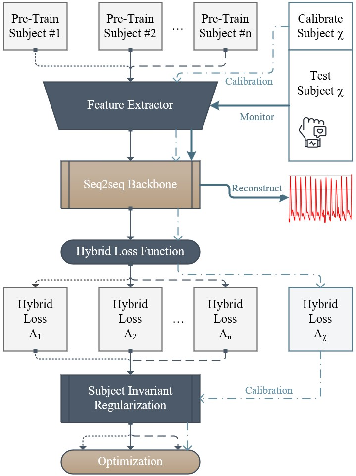

# ArterialNet: Arterial Blood Pressure Reconstruction
This is the code Implementation for our BHI-2023 submission: `ArterialNet: Arterial Blood Pressure Reconstruction` {add link}. 
Corresponding Author: [Sicong Huang](mailto:siconghuang@tamu.edu).
## Abstract
Continuous arterial blood pressure (ABP) monitoring for hemodynamic monitoring is accurate but invasive. Peripheral pulsatile signals paired with deep learning (DL) reconstruct ABP noninvasively but underestimated derived physiological parameters such as systolic BP (SBP) and diastolic BP (DBP). ArterialNet takes a model-agnostic approach that extracts features from longer sequences, evaluates statistical characteristics via hybrid loss, and converges to population instead of any subject via subject-invariant regularization, thus provides elevated waveform reconstruction with accurate SBP/DBP estimation. ArterialNet reconstructed ABP with waveform root-mean-squared-error (RMSE) of 6.81 ± 1.94 mmHg, SBP RMSE of 7.20 ± 1.93 mmHg, and DBP RMSE of 5.26 ± 1.83 mmHg. The lower errors and significantly lower stand deviation prove ArterialNet’s superior reliability in continuous ABP waveform reconstruction. 
## Implementations

### ArterialNet Framework
`models/arterialnet.py` contains the implementation of our proposed ArterialNet framework along with the U-Net and Transformer backbone architectures.

U-Net implementation is based on [Seq-U-Net](https://github.com/f90/Seq-U-Net)

### ArterialNet + U-Net on MIMIC 
`run_torch_sequnet_rex.py` is the implementation of ArterialNet with U-Net as backbone on reconstructing ABP for MIMIC patients

`run_torch_sequnet.py` is the version without subject-invariant regularization for comparison

### ArterialNet + Transformer on MIMIC 
`run_torch_transformer_rex.py` is the implementation of ArterialNet with Transformer as backbone on reconstructing ABP for MIMIC patients

`run_torch_transformer.py` is the version without subject-invariant regularization for comparison

## Datasets

### MIMIC III Waveform Dataset

`/utils/mimic_file_list.txt` contains the selected subjects from our paper submission.

### Bio-Impedance Experiments 

Please refer to this [paper](https://ieeexplore.ieee.org/document/8863984). 

## Evaluation

`utils/visual_combine.py` has the following evaluation metrics implemented and ready to used:

* ABP Waveform: 
    * Root Mean Squared Error (RMSE)
    * Mean Absolute Error (MAE)
    * Pearson's Correlation Coefficient (R)
    * Waveform Reconstruction vs. reference plot
* SBP/DBP (all of above plus):
    * Bland-Altman Plots
    * Confusion Matrix of hypertension stages 
    * SBP/DBP prediction vs. reference plots

## Installation

`arterialnet.yml` contains the conda environment used for our experiments.

Some spceifications: 
* Linux-based OS 
* Python 3.9.15
* conda 4.14.0
* PyTorch 1.11.0
* CUDA 11.4 or 11.6 (for GPU acceleration)

Download the repository and install the conda environment:

``` 
git pull https://github.com/Innoversa/ArterialNet.git 
cd ArterialNet 
conda env create -f arterialnet.yml 
conda activate arterialnet 
```