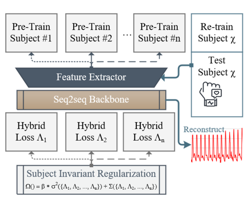

# ArterialNet: Arterial Blood Pressure Reconstruction
This is the code Implementation for our BHI-2023 submission: `ArterialNet: Arterial Blood Pressure Reconstruction` {add link}. 
Corresponding Author: [Sicong Huang](mailto:siconghuang@tamu.edu).

## Prerequisites

### Setup Environment
Our experiments are conducted on a Linux-based machine with the following specifications:

* Linux-based OS 
* Python 3.9.15
* conda 4.14.0
* PyTorch 1.11.0
* git 2.25.1
* CUDA 11.4 or 11.6 (for GPU acceleration)

We highly recommend you to use our shared conda environment (`arterialnet.yml`) we shared to avoid potential compatibility issue. To setup Conda for your computer, you can follow the instructions [here](https://conda.io/projects/conda/en/latest/user-guide/install/index.html).

Command Line Input Steps: 

1. `git pull https://github.com/Innoversa/ArterialNet.git` clones the repository to your local machine

2. `cd ArterialNet/` changes the directory to the repository

3. `conda env create -f arterialnet.yml` creates a new conda environment same as ours (`arterialnet.yml` contains the packages used for our experiments.)

4. `conda activate arterialnet` activates the created conda environment you just created

## Code Implementations

### ArterialNet Framework

* `models/arterialnet.py` contains the implementation of our proposed ArterialNet framework along with the U-Net and Transformer backbone architectures.
    * U-Net implementation is based on [Seq-U-Net](https://github.com/f90/Seq-U-Net) in Pytorch
    
    * Transformer implementation is based on [PyTorch Transformer](https://pytorch.org/docs/stable/generated/torch.nn.Transformer.html)

* `python run_torch_sequnet_rex.py` runs the ArterialNet + U-Net model on MIMIC III Waveform Dataset (see below for more details)

### Experiment: ArterialNet + U-Net on MIMIC 
`run_torch_sequnet_rex.py` is the implementation of ArterialNet with U-Net as backbone on reconstructing ABP for MIMIC patients

`run_torch_sequnet.py` is the base version without subject-invariant regularization 
### Experiment: ArterialNet + Transformer on MIMIC 
`run_torch_transformer_rex.py` is the implementation of ArterialNet with Transformer as backbone on reconstructing ABP for MIMIC patients

`run_torch_transformer.py` is the base version without subject-invariant regularization 

## Datasets

### MIMIC III Waveform Dataset

* You can request and download MIMIC-III Waveform from [here](https://physionet.org/content/mimiciii/1.4/).

* Select your cohort of patients and download. For example:  [mimic_file_list.txt](utils/mimic_file_list.txt)

* Specify argument `--data_path` with your data path, otherwise change the default value in [arg_parser.py](utils/arg_parser.py)

### Bio-Impedance Experiments 

Please refer to this [paper](https://ieeexplore.ieee.org/document/8863984). 

## Evaluation

`utils/visual_combine.py` has the following evaluation metrics implemented and ready to used:

* ABP Waveform: 
    * Root Mean Squared Error (RMSE)
    * Mean Absolute Error (MAE)
    * Pearson's Correlation Coefficient (R)
    * Waveform Reconstruction vs. Reference Plot
* SBP/DBP (all of above plus):
    * Bland-Altman Plots
    * Confusion Matrix of hypertension stages 
    * SBP/DBP Prediction vs. Reference Plots
